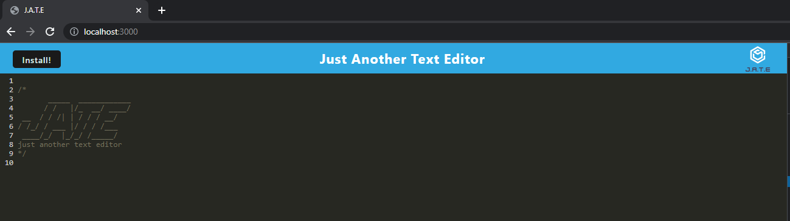
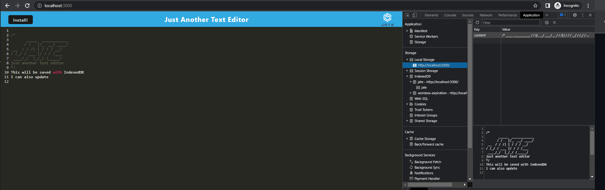
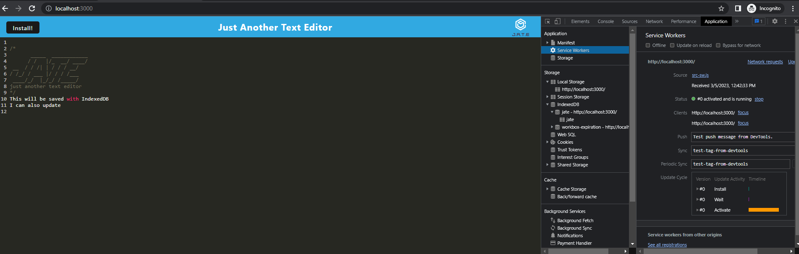

# Text Editor
JATE - Just Another Text Editor

## Description

This application allows users to create notes or text snippets in a text editor that can be used on or offline.  Users can reliably retrieve data for later use.

## Installation

git clone the repo to your local machine. To use this application, run the following command to install the dependencies:

* npm install

Then run the following command:

* npm run start:dev

## Usage

Deployed site:[J.A.T.E](https://warm-mesa-20580.herokuapp.com/)
GitHub:[Text Editor](https://github.com/KateRitchie/textEditor)

J.A.T.E (Just Another Text Editor)

Contest retrieved from IndexedDB

Static assets pre cached

## Credits

https://www.youtube.com/watch?v=8UFOSQXT_pg

https://javascript.info/indexeddb

https://www.npmjs.com/package/idb

Start code: https://github.com/coding-boot-camp/cautious-meme